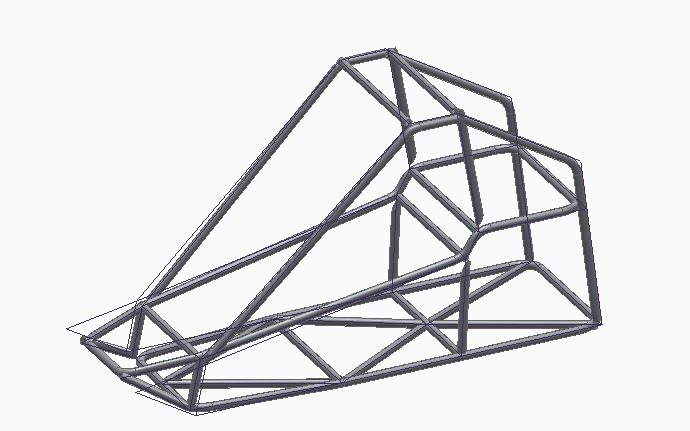
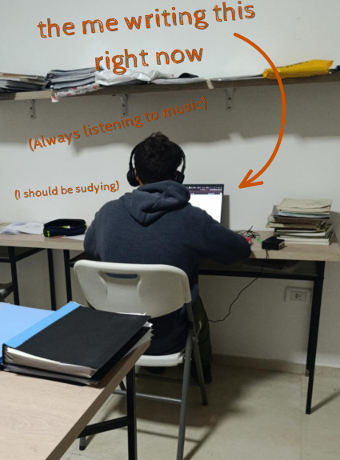

# ♻️Biomass Kart🏎️
> `A functional biomass-powered Kart with IoT Telemetry`

## 📄[Documentation](./documentation) (Hack Club requirements)
Here you will find the main resources and documentation of the project.
#### 📋💲[Budget BOM (Bill of materials)](./documentation/budget)
#### [✏️📐Kart Blueprints](./documentation/blueprints)
#### [⚡​🔌​Electric Diagram](./documentation/wiring.jpg)

## 🔎[Research](./Research)
### Check the fundamentation of the project [here](./research) 

## 📰Updates⚙️
### Check my recent progress building and working [here](https://macondo.hackclub.com/projects/15880)

# ♻️Biomass Kart🏎️

 

## Who's behind & Why

Hello! I am Valentino, an Argentine Electromechanics Technician Student, enthusiastic about Physics and Science. I have always wanted to learn about vehicle mechanics and apply some of my electronics knowledge (which is currently expanding). This kart project has always been something I wanted to do, but I didn't have the money. Recently I discovered Hack Club, and I haven't stopped searching and learning since then to document this and make it a reality.

## What is this project?

It consists of a functional Buggy Kart which works with a Combustion Engine Motor, but is adapted to work with an incomplete combustion of organic residue (more info below, keep reading), adding to this some sensors for gas, speed, temperature, among others, controlled by a microcontroller like the ESP32. 

## It will work.

Check all my research [here](./documentation)

This Biomass can be used as a fuel and was implemented on a combustion engine by one of my idols, the Argentine Engineer [Edmundo Ramos](https://tn.com.ar/sociedad/2026/02/17/un-cordobes-creo-un-auto-que-funciona-con-basura-planea-viajar-a-brasil-y-busca-copiloto-los-requisitos/), who developed this system and made guides for everyone to build it, featured on his website [www.autoabasura.com](https://autoabasura.com/home/).

Also, this will work because I am on the penultimate year of my Technical Electromechanics and Mechatronics School ["4-117 Ejército de Los Andes ENET"](https://www.instagram.com/4117ejercitodelosandes?wa_status_inline=true) and I have the support and encouragement of my teachers. I have made many projects and courses on my own and with my school, which you can check [Here](https://www.linkedin.com/in/valentino-verdini-barbadillo/). Also I consider myself a very active person that dont give up and always try till get the result. Thanks for reading and reach the bottom of this presentation.

